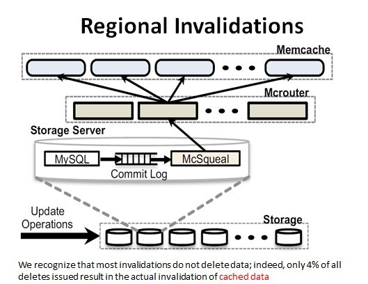
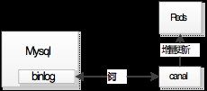
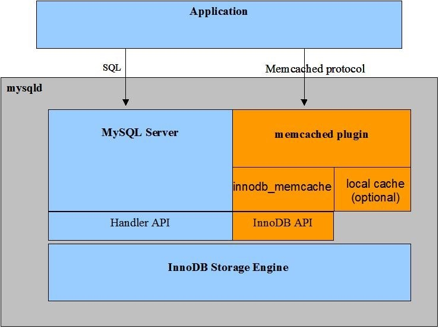

<!-- GFM-TOC -->
* [一、缓存特征](#一缓存特征)
* [二、LRU](#二lru)
* [三、缓存位置](#三缓存位置)
* [四、CDN](#四cdn)
* [五、缓存问题](#五缓存问题)
* [六、数据分布](#六数据分布)
* [七、一致性哈希](#七一致性哈希)
* [参考资料](#参考资料)
<!-- GFM-TOC -->


# 一、缓存特征

## 命中率

当某个请求能够通过访问缓存而得到响应时，称为缓存命中。

缓存命中率越高，缓存的利用率也就越高。

## 最大空间

缓存通常位于内存中，内存的空间通常比磁盘空间小的多，因此缓存的最大空间不可能非常大。

当缓存存放的数据量超过最大空间时，就需要淘汰部分数据来存放新到达的数据。

## 淘汰策略

- FIFO（First In First Out）：先进先出策略，在实时性的场景下，需要经常访问最新的数据，那么就可以使用 FIFO，使得最先进入的数据（最晚的数据）被淘汰。

- LRU（Least Recently Used）：最近最久未使用策略，优先淘汰最久未使用的数据，也就是上次被访问时间距离现在最久的数据。该策略可以保证内存中的数据都是热点数据，也就是经常被访问的数据，从而保证缓存命中率。

# 二、LRU

以下是基于 双向链表 + HashMap 的 LRU 算法实现，对算法的解释如下：

- 访问某个节点时，将其从原来的位置删除，并重新插入到链表头部。这样就能保证链表尾部存储的就是最近最久未使用的节点，当节点数量大于缓存最大空间时就淘汰链表尾部的节点。
- 为了使删除操作时间复杂度为 O(1)，就不能采用遍历的方式找到某个节点。HashMap 存储着 Key 到节点的映射，通过 Key 就能以 O(1) 的时间得到节点，然后再以 O(1) 的时间将其从双向队列中删除。

```java
public class LRU<K, V> implements Iterable<K> {

    private Node head;
    private Node tail;
    private HashMap<K, Node> map;
    private int maxSize;

    private class Node {

        Node pre;
        Node next;
        K k;
        V v;

        public Node(K k, V v) {
            this.k = k;
            this.v = v;
        }
    }


    public LRU(int maxSize) {

        this.maxSize = maxSize;
        this.map = new HashMap<>(maxSize * 4 / 3);

        head = new Node(null, null);
        tail = new Node(null, null);

        head.next = tail;
        tail.pre = head;
    }


    public V get(K key) {

        if (!map.containsKey(key)) {
            return null;
        }

        Node node = map.get(key);
        unlink(node);
        appendHead(node);

        return node.v;
    }


    public void put(K key, V value) {

        if (map.containsKey(key)) {
            Node node = map.get(key);
            unlink(node);
        }

        Node node = new Node(key, value);
        map.put(key, node);
        appendHead(node);

        if (map.size() > maxSize) {
            Node toRemove = removeTail();
            map.remove(toRemove);
        }
    }


    private void unlink(Node node) {
        Node pre = node.pre;
        Node next = node.next;
        pre.next = next;
        next.pre = pre;
    }


    private void appendHead(Node node) {
        node.next = head.next;
        node.pre = head;
        head.next = node;
    }


    private Node removeTail() {
        Node node = tail.pre;
        tail.pre = node.pre;
        return node;
    }


    @Override
    public Iterator<K> iterator() {

        return new Iterator<K>() {
            private Node cur = head.next;
            @Override
            public boolean hasNext() {
                return cur != tail;
            }

            @Override
            public K next() {
                Node node = cur;
                cur = cur.next;
                return node.k;
            }
        };
    }
}
```

# 三、缓存位置

## 浏览器

当 HTTP 响应允许进行缓存时，浏览器会将 HTML、CSS、JavaScript、图片等静态资源进行缓存。

## ISP

网络服务提供商（ISP）是网络访问的第一跳，通过将数据缓存在 ISP 中能够大大提高用户的访问速度。

## 反向代理

反向代理位于服务器之前，请求与响应都需要经过反向代理。通过将数据缓存在反向代理，在用户请求反向代理时就可以直接使用缓存进行响应。

## 本地缓存

使用 Guava Cache 将数据缓存在服务器本地内存中，服务器代码可以直接读取本地内存中的缓存，速度非常快。

## 分布式缓存

使用 Redis、Memcache 等分布式缓存将数据缓存在分布式缓存系统中。

相对于本地缓存来说，分布式缓存单独部署，可以根据需求分配硬件资源。不仅如此，服务器集群都可以访问分布式缓存，而本地缓存需要在服务器集群之间进行同步，实现难度和性能开销上都非常大。

## 数据库缓存

MySQL 等数据库管理系统具有自己的查询缓存机制来提高查询效率。

# 四、CDN

内容分发网络（Content distribution network，CDN）是一种互连的网络系统，它利用更靠近用户的服务器从而更快更可靠地将 HTML、CSS、JavaScript、音乐、图片、视频等静态资源分发给用户。

CDN 主要有以下优点：

- 更快地将数据分发给用户；
- 通过部署多台服务器，从而提高系统整体的带宽性能；
- 多台服务器可以看成是一种冗余机制，从而具有高可用性。

<div align="center">  </div><br>

# 五、缓存问题

## 缓存穿透

指的是对某个一定不存在的数据进行请求，该请求将会穿透缓存到达数据库。

解决方案：

- 对这些不存在的数据缓存一个空数据；
- 对这类请求进行过滤。

## 缓存雪崩

指的是由于数据没有被加载到缓存中，或者缓存数据在同一时间大面积失效（过期），又或者缓存服务器宕机，导致大量的请求都到达数据库。

在有缓存的系统中，系统非常依赖于缓存，缓存分担了很大一部分的数据请求。当发生缓存雪崩时，数据库无法处理这么大的请求，导致数据库崩溃。

解决方案：

- 为了防止缓存在同一时间大面积过期导致的缓存雪崩，可以通过观察用户行为，合理设置缓存过期时间来实现；
- 为了防止缓存服务器宕机出现的缓存雪崩，可以使用分布式缓存，分布式缓存中每一个节点只缓存部分的数据，当某个节点宕机时可以保证其它节点的缓存仍然可用。
- 也可以进行缓存预热，避免在系统刚启动不久由于还未将大量数据进行缓存而导致缓存雪崩。

## 缓存一致性

大家都了解，依据CAP原理，在高可用性、一致性和分区容忍性三者只能取其二。而使用缓存最大的好处就是提升性能，减少数据库访问的压力。如何保障数据一致性是一个不得不面对的问题。这里的一致性包括缓存数据与数据库数据的一致性，亦包括多级缓存数据之间的一致性。在绝大部分场景下，追求最终一致性。

1. 最终一致性

大部分情况下对于缓存数据与数据库数据的一致性没有绝对强一致性要求，那么在写缓存失败的情况下，可以通过补偿动作进行，达到最终一致性。
我们来看看Facebook是如何做的。Facebook是通过更新数据库（图16-15中的Storage）之后，把需要删除的key给到McSqueal，然后异步删除缓存数据的模式。这样下一次get请求时，如果没有数据，则从数据库里查询同时更新到memcached集群。

 <div align="center">  </div><br>
 
图16-15 Facebook最终一致性方案 

对于时间敏感数据可以设置很短的过期时间(失效时间)，这样一旦超过失效时间，就可以从数据库重新加载。
保持最终一致性的方法有很多，再举一列。京东采用了通过canal更新缓存原子性的方法，如图16-16所示。

<div align="center">  </div><br>

图16-16 最终一致性方案

几个关注点：
- 更新数据时使用更新时间戳或者版本对比，如果使用Redis可以利用其单线程机制进行原子化更新；
- 使用如canal订阅数据库binlog；此处把mysql看成发布者，binlog是发布的内容，canal(canal 是阿里巴巴mysql数据库binlog的增量订阅&消费组件)看成消费者，canal订阅binlog然后更新到Redis。
- 将更新请求按照相应的规则分散到多个队列，然后每个队列的进行单线程更新，更新时拉取最新的数据保存；更新之前获取相关的锁再进行更新。

2. 强一致性

可以使用InnoDB memcached 插件结合mysql来解决缓存数据与数据库数据一致性问题。图16-17是其应用架构图。
 
 <div align="center">  </div><br>

图16-17 InnoDB memcached 插件架构图

在安装配置中就能发现，cache_policies表定义了缓存策略，包含如下选择：
- innodb_only：只使用InnoDB作为数据存储。
- cache-only：只使用传统的Memcached引擎作为后端存储。
- caching：二者皆使用，如果在Memcached里找不到，就查询InnoDB。

那么在数据库读操作的时候，使用caching模式，则使用了Memcached缓存。在数据库写操作层面，在存储引擎中实现缓存数据和存储数据一致性。经过评测，读性能比直接读数据库提升1倍以上，当然，性能不如单纯的内存Memcached存储模式。


# 六、数据分布

## 哈希分布

哈希分布就是将数据计算哈希值之后，按照哈希值分配到不同的节点上。例如有 N 个节点，数据的主键为 key，则将该数据分配的节点序号为：hash(key)%N。

传统的哈希分布算法存在一个问题：当节点数量变化时，也就是 N 值变化，那么几乎所有的数据都需要重新分布，将导致大量的数据迁移。

## 顺序分布

将数据划分为多个连续的部分，按数据的 ID 或者时间分布到不同节点上。例如 User 表的 ID 范围为 1 \~ 7000，使用顺序分布可以将其划分成多个子表，对应的主键范围为 1 \~ 1000，1001 \~ 2000，...，6001 \~ 7000。

顺序分布相比于哈希分布的主要优点如下：

- 能保持数据原有的顺序；
- 并且能够准确控制每台服务器存储的数据量，从而使得存储空间的利用率最大。

# 七、一致性哈希

Distributed Hash Table（DHT） 是一种哈希分布方式，其目的是为了克服传统哈希分布在服务器节点数量变化时大量数据迁移的问题。

## 基本原理

将哈希空间 [0, 2<sup>n</sup>-1] 看成一个哈希环，每个服务器节点都配置到哈希环上。每个数据对象通过哈希取模得到哈希值之后，存放到哈希环中顺时针方向第一个大于等于该哈希值的节点上。

<div align="center">  </div><br>

一致性哈希在增加或者删除节点时只会影响到哈希环中相邻的节点，例如下图中新增节点 X，只需要将它前一个节点 C 上的数据重新进行分布即可，对于节点 A、B、D 都没有影响。

<div align="center">  </div><br>

## 虚拟节点

上面描述的一致性哈希存在数据分布不均匀的问题，节点存储的数据量有可能会存在很大的不同。

数据不均匀主要是因为节点在哈希环上分布的不均匀，这种情况在节点数量很少的情况下尤其明显。

解决方式是通过增加虚拟节点，然后将虚拟节点映射到真实节点上。虚拟节点的数量比真实节点来得多，那么虚拟节点在哈希环上分布的均匀性就会比原来的真实节点好，从而使得数据分布也更加均匀。

# 参考资料

- 大规模分布式存储系统
- [深入分布式缓存](https://blog.csdn.net/wireless_com/article/details/79118283)
- [缓存那些事](https://tech.meituan.com/cache_about.html)
- [一致性哈希算法](https://my.oschina.net/jayhu/blog/732849)
- [内容分发网络](https://zh.wikipedia.org/wiki/%E5%85%A7%E5%AE%B9%E5%82%B3%E9%81%9E%E7%B6%B2%E8%B7%AF)
- [How Aspiration CDN helps to improve your website loading speed?](https://www.aspirationhosting.com/aspiration-cdn/)
